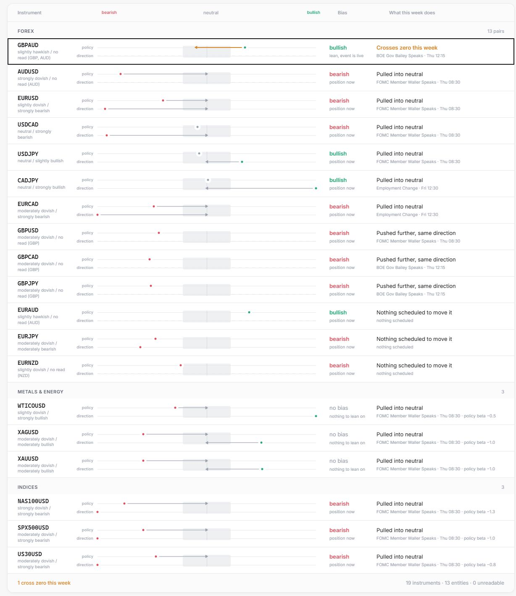

# Fundamental Engine

[](https://github.com/prentopoulos/fundamental-engine/actions/workflows/ci.yml)


**Understand what macroeconomic news is saying now, and what the coming week's events could change.**

Fundamental Engine turns headlines and an economic calendar into an explainable research board for currencies, commodities, and equity indices. It keeps two questions separate: are interest-rate expectations moving up or down, and is the broader economic story supportive or negative? Each read links back to the situations behind it.

**In active development.** The engine is runnable, with ongoing improvements to the research pipeline and dashboard.

## What you get

- A local dashboard covering **19 instruments and 13 underlying entities**.
- Separate **current** and **expected** reads, with the event that could change them.
- Short explanations, supporting situations, counter-evidence, and timestamps.
- A command-line report, optional automatic refreshes, and a local chat desk.
- An optional MCP server so an external assistant can query saved results.

| Term | Plain meaning |
| --- | --- |
| Hawkish / dovish | Evidence for tighter / looser monetary policy. |
| Bullish / bearish | Evidence supporting / weighing against the entity. |
| Neutral | Enough evidence exists, but the net score does not clear the threshold. |
| No read | Evidence is missing, too thin, or too faded to make a call. |
| Situation | One ongoing development, updated as more headlines arrive. |

For non-FX instruments, the policy lane represents their configured response to rate policy. For example, a hawkish USD policy read produces a negative policy contribution for an equity index. It does not describe that index as having its own central bank.



*Instrument board from a live research refresh on 8 October 2026 (UTC). Current evidence and expected calendar effects are shown separately.*

The screenshot shows live mode. The free demo below uses fictional examples; live refreshes require your own Anthropic API key and API credit.

## Try it first — no key needed

You need **Python 3.11 or newer** and Git. Initial installation needs internet access. The demo then runs offline with fictional examples, uses the real scoring code, and makes no model calls.

Check `python --version` first. If it shows a version below 3.11, create the environment with your newer Python instead. For example, use `py -3.13 -m venv .venv` on Windows if Python 3.13 is installed, or `python3 -m venv .venv` on macOS/Linux if `python3 --version` shows 3.11 or newer.

```bash
git clone https://github.com/prentopoulos/fundamental-engine.git
cd fundamental-engine
python --version
python -m venv .venv
```

**Windows PowerShell:**

```powershell
.\.venv\Scripts\python.exe -m pip install -e .
.\.venv\Scripts\python.exe -m engine.demo
```

**macOS / Linux:**

```bash
.venv/bin/python -m pip install -e .
.venv/bin/python -m engine.demo
```

Open **http://127.0.0.1:8000**. Stop with Ctrl+C. The demo uses a temporary database; live results are kept separately. Chat and refresh are disabled in the demo. If port 8000 is busy, add `--port 8001`.

## Choose how to run it

The commands below use `python` from your activated environment. You can also use the full interpreter path shown above; PowerShell activation is not required. Run from the repository folder.

| Mode | Command | Requires |
| --- | --- | --- |
| Offline demo | `python -m engine.demo` | No API key or agent. |
| One live research pass | `python -m engine` | Your own Anthropic API key and API credit; live feed access. |
| View saved results | `python -m engine.web` | No key to browse; refresh and chat use the API. |
| Automatic reads + dashboard | `python scripts/run_loop.py` | Live setup and `loop.ENABLED: true`. |
| External assistant via MCP | `python mcp_server.py` | Install `.[mcp]`, an MCP client, and saved live results. |

**Live analysis is bring your own API key, not bring your own agent.** The built-in pipeline calls Anthropic directly. You can change the Claude model used by each stage in `config/params.yaml`; other providers and local models are not supported out of the box. **MCP is an optional bring your own assistant interface** for reading existing results. That assistant does not replace the live analysis pipeline.

### First live run

Copy `.env.example` to `.env` and set `ANTHROPIC_API_KEY`. On PowerShell, use `Copy-Item .env.example .env`; on macOS/Linux, use `cp .env.example .env`. Keep the key private.

```bash
python -m engine
python scripts/inspect_pass.py
python -m engine.web
```

The inspection command checks situation identifiers, citations, and missing-evidence states. Read the actual explanations as well: passing integrity checks does not establish economic accuracy. A first live pass may take several minutes and incur API charges.

The scheduler ships **disabled**. If enabled, the default cadence refreshes on watched high-impact releases, five minutes after their scheduled time. Set `HOURLY_MINUTES` to a positive number for additional periodic reads. See [run options and troubleshooting](docs/running.md).

## How we weigh evidence

The approach combines **structured language-model interpretation** with **deterministic Python arithmetic**:

1. Filter relevant headlines and identify the entities they affect.
2. Assign a policy or directional axis, a positive or negative sign, and a magnitude from 1 to 10.
3. Group related headlines into situations so repeated coverage does not count as independent corroboration.
4. Reduce older evidence's weight, then add its signed contributions.
5. Require enough material evidence before assigning a direction. Keep upcoming calendar expectations separate.

In plain terms: **larger, fresher developments matter more; repeated versions of one story do not automatically make it stronger.** Opposing evidence reduces the net score, and missing evidence stays visible.

```text
contribution = magnitude × sign × 0.5^(age / half-life)
current score = sum of situation contributions on one axis
```

Policy evidence has a 21-day half-life; directional evidence has a 7-day half-life. A magnitude-6 directional situation contributes +6 when fresh and +3 seven days later. A fresh -4 situation alongside it makes the score -1. With adequate breadth, that reads neutral rather than bearish.

The default directional threshold is **±3.5**. Breadth normally requires **two situations**, each still contributing at least **1.75 in absolute value**. One material situation of magnitude **7 or higher** can meet the breadth rule by itself; the score must still clear the threshold.

Currency pairs use **base minus quote** on each axis. Non-FX instruments use explicit coefficients: for example, Nasdaq's USD policy weight is **-1.3**, versus **-1.0** for the S&P 500 and **-0.8** for the Dow. These express assumed relative sensitivity, not measured return betas.

The expected lane describes what scheduled events imply **if forecasts broadly materialize**. Attention ranking favours a larger change, a nearer event, and higher stated confidence. Confidence weights are ranking multipliers, not calibrated probabilities.

See [methodology, formulas, and limitations](docs/methodology.md) for the complete rules and a proposed validation approach.

## Project layout

```text
engine/           Python pipeline, scoring, storage, local web UI, and prompts
config/           Instruments, transmission weights, models, and tunable rules
scripts/          Scheduler, pass inspection, archive replay, model comparison
tests/            Offline tests and synthetic/recorded parser fixtures
docs/             Methodology, architecture, and run instructions
.github/          CI, issue forms, and pull-request template
```

Results live in `data/engine.db`; model replay files live in `build/model_cache`. Both are private local working files and excluded from Git.

## Development

This release is intended to run from a source checkout with an editable install.

```bash
python -m pip install -e ".[dev,mcp]"
python -m pytest -q
python -m ruff check .
python -m ruff format --check .
```

Tests use injected feeds and model responses; they need no API key and do not measure market performance. Contributions should include relevant checks and clearly explain any changed assumption. See [CONTRIBUTING.md](CONTRIBUTING.md), [architecture](docs/architecture.md), and [security reporting](SECURITY.md).

## Licence

Source-available under the [PolyForm Noncommercial License 1.0.0](LICENSE.md). Non-commercial use, modification, and redistribution are permitted subject to its terms. Commercial use requires separate permission. See [NOTICE.md](NOTICE.md).
