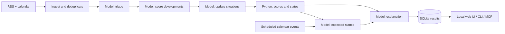

# Architecture

A fixed pipeline turns untrusted feed text into stored, inspectable research outputs. It has no autonomous planning loop and cannot place orders.

## Module boundaries

| Module | Responsibility |
| --- | --- |
| `engine/feeds/` | Bounded fetching, hardened parsing, stable item identity, ingestion. |
| `engine/prompts/` | Versioned instructions for each model stage. |
| `engine/model/` | API client, request hashing, disk replay cache. |
| `engine/stages.py` | Model routing, output validation, token/cost ledger. |
| `engine/situations/` | Durable situation identity, evidence links, lifecycle. |
| `engine/reading/` | Deterministic contribution scores, breadth, states, degree labels. |
| `engine/expectation/` | Forward calendar reading, attention rank, heuristic stance labels. |
| `engine/universe/` | Config loading, entity derivation, instrument coefficients. |
| `engine/narrative/` | Fact sheets and checks on generated explanations. |
| `engine/store/` | SQLite schema, transactions, database isolation. |
| `engine/passes.py` | Fixed stage orchestration and result persistence. |
| `engine/loop.py`, `engine/triggers.py` | Scheduling, release grouping, change detection. |
| `engine/web/`, `engine/desk/` | Views and queries over saved results. |
| `engine/demo.py` | Synthetic examples in an isolated temporary database. |

## Storage and recovery

SQLite stores raw feed records, situations, entity links, evidence links, axis reads, expectations, narratives, pass metadata, and chat history. Current and expected lanes use separate tables. Foreign keys and explicit transactions protect related writes.

Feed ingestion and triage are durable checkpoints. Scored headlines remain pending until their situation changes are committed in the same transaction. The final board is published only after the main stages finish. Failed passes retain stage metadata and estimated costs.

Situation updates can commit before a later stage fails; this is deliberate resumable work, not a fully transactional pass. The last completed board remains available, but live situation records may have progressed beyond that board. Keep the pass timestamps in view when inspecting old results.

Change detection compares contributor IDs, states, degrees, and rounded scores. Calendar-window changes are checked separately before an expectation is carried forward. Unchanged prose retains its original authorship time.

## Local operation

The web server binds to loopback. The combined scheduler/dashboard process shares one refresh lock. Multiple independent writers are outside the supported deployment model.

MCP opens existing data read-only. The offline demo blocks mutation endpoints and constructs no model client. Runtime prompts and templates are included as package resources; editable source installation is the supported workflow.

## Testing

Tests inject feed bodies, clocks, and model answers to exercise arithmetic, validation, recovery, citations, scheduling, isolation, and rendered views without API calls. CI runs lint, formatting checks, and tests on Windows and Linux. Software correctness and economic validity are separate questions; see [methodology](methodology.md).
